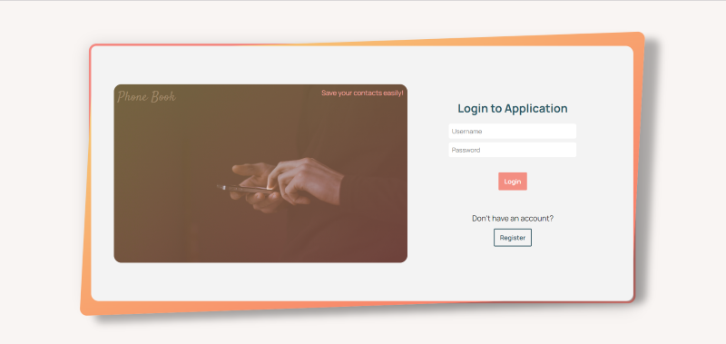

# 📞Phonebook Project

A simple phonebook app with a focus on both frontend and backend. This application allows users to add, update, or delete contacts.

# Visual of the project

# Features

- Add new contacts with names, phone numbers.
- Update existing contacts with new information
- Delete Contacts from phonebook
- Search and filter contacts based on name or phone number

# Built with

- Frontend: HTML, CSS, JavaScript
- Backend: Node.js, Express.js
- Database: MongoDB

# Testing

- Unit testing: The frontend code is tested using Jest framework. Run tests with the command: `npm test`
- Integration testing: The backend API endpoints are testes using Jest framework. Run tests with the command: `npm test`
- End-to-end testing: The application is tested using Cypress for end-to-end scenarios, ensuring smooth interaction between frontend and backend.
  -To run end-to-end tests:

Make sure your backend is running in test mode `npm run start:test`

1. In Frontend, start project, ``npm run dev`
2. In a seperate terminal, run Cypress: `npm run cypress:open`
3. Cypress asks what type of tests you want to choose, choose "E2E Testing", then click "Create new spec"
4. Cypress Test Runner will open. Click on a test file to run the tests in the browser.

# Reach Phonebook

You can reach the work here, [Phonebook](https://phonebookbe-0lkp.onrender.com/)

Frontend Code, [Phonebook FE](https://github.com/berenvrl/phonebookFE.git)

# Installation

1. Clone the repository
2. Install dependencies:`npm install`
3. Start the server: `npm run dev`
4. Open the app in your browser
